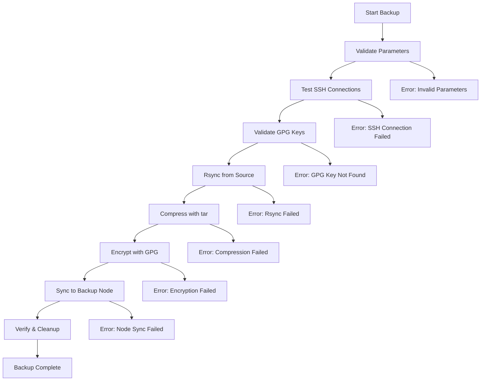

# 🔐 SecSync

[](https://opensource.org/licenses/MIT)
[](https://www.gnu.org/software/bash/)
[](https://www.linux.org/)
[](https://github.com/yourusername/SecSync/releases)

**Secure, encrypted, and automated backup solution for Linux servers with multi-node synchronization.**

SecSync is a robust bash script that performs automated backups with GPG encryption, rsync synchronization, and comprehensive logging. Perfect for system administrators who need reliable, secure backup solutions.

## ✨ Features

- 🔒 **GPG Encryption** - Military-grade encryption for your backups
- 🚀 **Rsync Synchronization** - Efficient file transfer and synchronization
- 📊 **Progress Tracking** - Real-time progress bars and status updates
- 📝 **Comprehensive Logging** - Detailed logs with timestamps for audit trails
- 🛡️ **Error Handling** - Robust error detection and recovery mechanisms
- 🔄 **Multi-node Sync** - Automatic synchronization to backup nodes
- ✅ **Validation** - File integrity checks at every step
- 🧹 **Auto Cleanup** - Automatic temporary file cleanup

## 🚀 Quick Start

### One-line Installation
```bash
curl -sSL https://raw.githubusercontent.com/kelvinprayoga46/SecSync/main/install.sh | bash
```

### Manual Installation
```bash
# Clone repository
git clone https://github.com/kelvinprayoga46/SecSync.git
cd SecSync

# Run installer
chmod +x install.sh
./install.sh

# Configure and run
nano SecSync.sh  # Edit configuration
./SecSync.sh 192.168.1.50 /home/data
```

## 📋 Requirements

| Component | Status | Installation |
|-----------|--------|--------------|
| **rsync** | Required | `apt install rsync` or `yum install rsync` |
| **gnupg** | Required | `apt install gnupg` or `yum install gnupg2` |
| **ssh** | Usually installed | `apt install openssh-client` |
| **bash, tar, coreutils** | Pre-installed | ✅ Available on all Linux distros |

### System Requirements
- **OS**: Linux (Ubuntu 18.04+, CentOS 7+, Debian 9+)
- **RAM**: 1GB minimum, 2GB+ recommended
- **Storage**: 2x backup data size (for temporary files)
- **Network**: SSH access to target servers

## ⚙️ Configuration

### 1. Setup SSH Keys
```bash
# Generate SSH key
ssh-keygen -t rsa -b 4096 -C "SecSync-automation"

# Copy to target servers
ssh-copy-id root@target-server
ssh-copy-id root@backup-node
```

### 2. Setup GPG Keys
```bash
# Generate GPG key pair
gpg --full-generate-key

# Or import existing keys
gpg --import public-key.asc
gpg --import private-key.asc
```

### 3. Configure Script
Edit the configuration section in `SecSync.sh`:
```bash
GPG_RECIPIENT="admin@yourdomain.com"    # Your GPG email
NODE2_SERVER="192.168.1.100"           # Backup node IP
BACKUP_DIR="/backup"                    # Local backup directory
```

## 🎯 Usage

### Basic Usage
```bash
# Backup remote directory
./SecSync.sh <server-ip> <source-directory>

# Example
./SecSync.sh 192.168.1.50 /home/data
./SecSync.sh web-server.local /var/www
```

### Advanced Examples
```bash
# Backup database server
./SecSync.sh 10.0.1.100 /var/lib/mysql

# Backup web application
./SecSync.sh web01.company.com /opt/applications

# Backup user home directories
./SecSync.sh fileserver.local /home
```

## 📊 Process Flow



## 📈 Sample Output

```bash
$ ./SecSync.sh 192.168.1.50 /home/data

[2024-07-26 10:30:15] [ PROSES BACKUP FILE DIMULAI ]
[2024-07-26 10:30:15] Server: 192.168.1.50
[2024-07-26 10:30:15] Source Directory: /home/data
[2024-07-26 10:30:15] Backup Filename: backup_192.168.1.50_240726103015.tar.gz
[2024-07-26 10:30:16] Validating GPG key...
[2024-07-26 10:30:16] Testing koneksi ke server source...
[2024-07-26 10:30:17] Testing koneksi ke node2...
[2024-07-26 10:30:18] Tahap 1: Memulai sinkronisasi dari server source...
[===========----------] 30%
[2024-07-26 10:32:45] Sinkronisasi selesai. Ukuran data: 2.3G
[2024-07-26 10:32:45] Tahap 2: Memulai kompresi...
[========================] 60%
[2024-07-26 10:35:12] Kompresi selesai. Ukuran file backup: 890M
[2024-07-26 10:35:12] Tahap 3: Memulai enkripsi...
[==============================] 80%
[2024-07-26 10:36:30] Enkripsi selesai. Ukuran file terenkripsi: 891M
[2024-07-26 10:36:30] Tahap 4: Memulai sinkronisasi ke node2...
[==================================] 90%
[2024-07-26 10:38:15] Sinkronisasi ke node2 selesai
[2024-07-26 10:38:15] Tahap 5: Membersihkan file temporary...
[======================================] 100%

[2024-07-26 10:38:16] [ PROSES BACKUP SELESAI ]
[2024-07-26 10:38:16] File backup berhasil disimpan di node2: /backup/backup_192.168.1.50_240726103015.tar.gz.asc
```


## 📁 Directory Structure

```
SecSync/
├── SecSync.sh           # Main backup script
├── install.sh            # Installation script
├── README.md            # This file
├── LICENSE              # MIT License
├── examples/
│   ├── cron-example.sh  # Cron job examples
│   └── config-example.sh # Configuration examples
└── docs/
    ├── INSTALLATION.md  # Detailed installation guide
    ├── CONFIGURATION.md # Configuration options
    └── TROUBLESHOOTING.md # Common issues and solutions
```

## 🕒 Automation with Cron

Add to crontab for automated backups:

```bash
# Daily backup at 2 AM
0 2 * * * /usr/local/bin/SecSync 192.168.1.50 /home/data >> /var/log/SecSync-cron.log 2>&1

# Weekly full backup on Sunday at 3 AM
0 3 * * 0 /usr/local/bin/SecSync web-server /var/www >> /var/log/SecSync-weekly.log 2>&1

# Monthly database backup on 1st day at 4 AM
0 4 1 * * /usr/local/bin/SecSync db-server /var/lib/mysql >> /var/log/SecSync-monthly.log 2>&1
```

## 📊 Monitoring & Logs

### Log Files
- **Main log**: `/var/log/backup_YYYYMMDD.log`
- **Cron log**: `/var/log/SecSync-cron.log`

### Real-time Monitoring
```bash
# Watch current backup progress
tail -f /var/log/backup_$(date +"%Y%m%d").log

# Check backup history
ls -la /var/log/backup_*.log

# Monitor backup node storage
ssh root@backup-node "df -h /backup"
```

OUBLESHOOTING.md).


## 📄 License

This project is licensed under the MIT License - see the [LICENSE](LICENSE) file for details.

## 🙏 Acknowledgments

- [rsync](https://rsync.samba.org/) - For efficient file synchronization
- [GnuPG](https://gnupg.org/) - For encryption capabilities
- [OpenSSH](https://www.openssh.com/) - For secure remote connections

## 📞 Support
- 🐛 **Bug Reports**: [Issues](https://github.com/yourusername/SecSync/issues)
- 💬 **Discussions**: [Telegram](https://t.me/itshelix)
- 📧 **Email**: kelvinprayoga46@gmail.com


<div align="center">

**Made with ❤️ by [M.Kelvin Prayoga](https://github.com/kelvinprayoga46)**

[⬆ Back to Top](#-SecSync)

</div>
